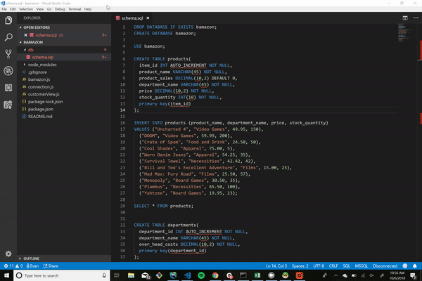
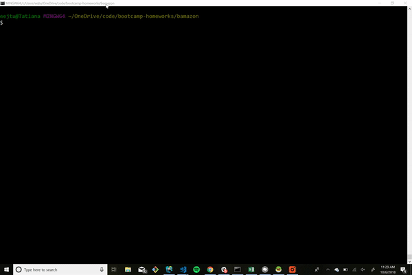

# Bamazon
its just like amazon...but totally different,

a node terminal app that allows a user to interact with a sql database to make purchases, add inventory, productss, and departments.

## Prerequesites
* [Node](https://nodejs.org/en/)
* [Git](https://git-scm.com/) (for windows) or Terminal (fpr Mac)
* [mySQL Community Server](https://dev.mysql.com/downloads/mysql/)
* [mySQL workbench](https://dev.mysql.com/downloads/workbench/?aktime=1383874389) (Windows or Mac),  [Sequel Pro](https://www.sequelpro.com/) (Mac) [HeidiSQL](https://www.heidisql.com/) (Windows) or a preferred SQL GUI

## Setup 
1. navigate to a directory in a terminal where you would like to clone the repository
2. Clone the repo to your machine
   * `git clone https://github.com/evanejtucker/bamazon.git`
3. navigate into the newly cloned repository
   * `cd bamazon`
4. install the dependencies
    * `npm install`
5. Start your SQL server by opening your preffered SQL GUI, and create a connection to your local daatabase
    * with help with workbench, refer to this [guide](https://dev.mysql.com/doc/workbench/en/wb-getting-started-tutorial-create-connection.html)
    * with help setting up sequel pro, refer to this [guide](https://www.sitepoint.com/sequel-pro-manage-mysql-databases/)
6. Once you are connected to your server, open a new query tab, then copy and paste the content from `db/schema.sql` into the new query tab, and run the content
7. You should see a success message, be able to see the newly created database and tables.

    

8. Back in the code, open up the `connection.js` file, and replace the connection info with the host, user, password, and database with the information you used to create your connection in your SQL GUI.
9.  Finally, you can run the command `node bamazon` to start the app. 

## Customer View

the Customer view allows users to see the products for sale, select one to purchase with a quantity, and update the database accordingly.  
* If there is an insufficient quantity in the db, the app will prompt the user to select a new quantity.
   

### Built With

* node
* sql
* javascript

## Authors

* Evan E J Tucker
